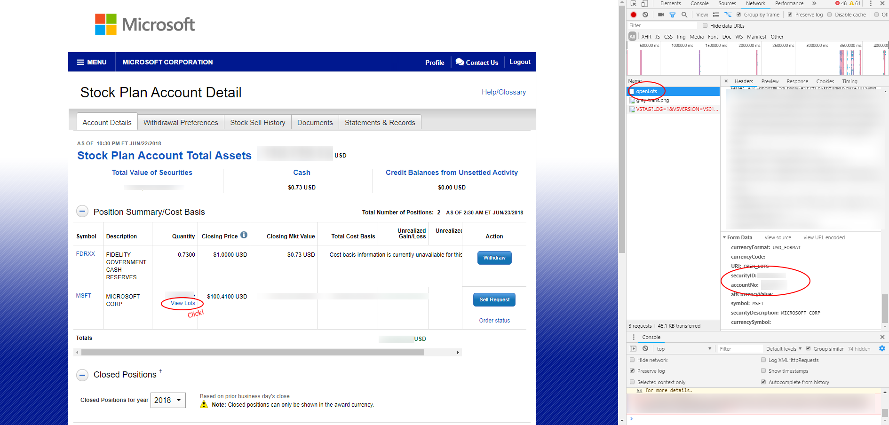

# Fidelity tool
This python script gathers information about shares you've got in last year and outputs nice XLSX sheet with information useful for your tax proclamation (in CZ only)

## ⚠️ fetch_data broken ⚠️
Fetching data from fidelity is currently broken, sorry :(  
But you still can use this tool to process json files manually downloaded from Fidelity - just get json responses from ```openLots``` and ```closedLots``` calls and store them in data folder as ```open_lots.json```, respectively ```closed_lots.json```. Then you can perform all the other actions. How to get to these calls is visible in [Where to get the AccountID and SecurityID?](#where-to-get-accountid-and-securityid)

## Use at your own risk
I am not responsible for your use of outputs of this script. If you want to use it for taxation purposes, you are doing so **on your own risk**.

## Usage
Script is CLI tool, you need to have ```python2.7``` installed. All the requirements are in ```requirements.txt``` file, install them via pip (```pip install -r requirements.txt --user```).
Then you can use fetch_data command to get necessary data from fidelity (currently not working - fidelity somehow enhanced protection of their site).
By running generate_xls you can generate xls document for your taxation (english translation is not fully completed).
```
$ ./fidelity.py -h
usage: fidelity.py [-h] {fetch_data,generate_xls,simulate_sell,csv,test} ...

Fetch your data from fidelity and show them in CSV/other usefull formats
needed to tax proclamation

positional arguments:
  {fetch_data,generate_xls,simulate_sell,csv,test}
    fetch_data          will download json data from the fidelity (currently
                        broken)
    generate_xls        Will generate xlsx file in same folder where script is
                        located
    simulate_sell       Show how much money will you have to pay if you decide
                        to sell your lots

optional arguments:
  -h, --help            show this help message and exit

$ ./fidelity.py generate_xls -h
usage: fidelity.py generate_xls [-h] [--year YEAR]
                                [--gross_income GROSS_INCOME]
                                [--total_premium TOTAL_PREMIUM] [--english]

optional arguments:
  -h, --help            show this help message and exit
  --year YEAR           Year about which do you care. Default is last year
                        (2019)
  --gross_income GROSS_INCOME
                        Gross income per given year
  --total_premium TOTAL_PREMIUM
                        Total premiums written per given year (Úhrn
                        povinného pojistného)
  --english             If you want to generate xls in english, add this
                        switch

$ ./fidelity.py simulate_sell -h
usage: fidelity.py simulate_sell [-h] [--expected_price EXPECTED_PRICE]
                                 [--expected_czk_usd EXPECTED_CZK_USD]
                                 [--expected_additional_stocks EXPECTED_ADDITIONAL_STOCKS]
                                 [--date DATE]

optional arguments:
  -h, --help            show this help message and exit
  --expected_price EXPECTED_PRICE
                        Expected price of shares at the moment of sell
  --expected_czk_usd EXPECTED_CZK_USD
                        Expected CZK/USD exchange rate at the moment of sell
  --expected_additional_stocks EXPECTED_ADDITIONAL_STOCKS
                        if you expect additional stocks to have at the time of
                        sell, specify the amount here (they'll be counted into
                        shares that needs to be taxed)
  --date DATE           Expected date of sell

$ ./fidelity.py fetch_data -h
usage: fidelity.py fetch_data [-h] [--password] [--username USERNAME]
                              [--accountID ACCOUNTID]
                              [--securityID SECURITYID] [--reload]

optional arguments:
  -h, --help            show this help message and exit
  --password            Will show password prompt, even when you have your
                        password stored in env variable (FIDELITY_PASSWORD)
  --username USERNAME   Fidelity username (you can setup env variable instead
                        - FIDELITY_USERNAME)
  --accountID ACCOUNTID
                        Fidelity accountID (you can setup env variable instead
                        - FIDELITY_ACCOUNT_ID); check
                        fidelity_account_id_security_id.png to see where to
                        find it
  --securityID SECURITYID
                        Fidelity securityID (you can setup env variable
                        instead - FIDELITY_SECURITY_ID); check
                        fidelity_account_id_security_id.png to see where to
                        find it
  --reload              You want to reload all the data (including stock price and currency exchange rate)?
```
<h2 id="where-to-get-accountid-and-securityid">Where to get the AccountID and SecurityID?</h2>


## Example
```./fidelity.py --generate_xls --gross_income 123456 --total_premium 123456```
## Translation
Output is partially localized, not all strings are covered. Any help appreciated.
